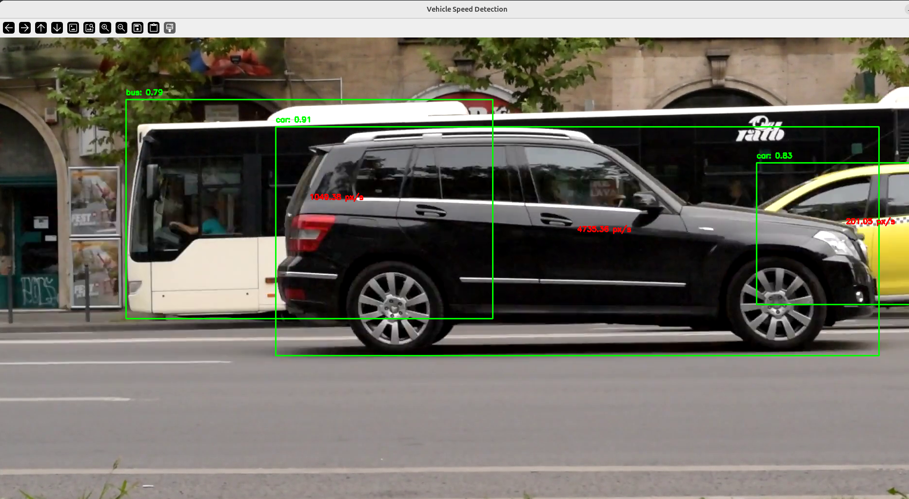
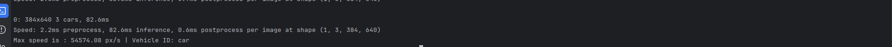

# Clone the repo
    1. Using ssh:
        git clone git@github.com:svetlanasekulic95/ComputerVision.git
    2. Using https:
        git clone https://github.com/svetlanasekulic95/ComputerVision.git
    
    cd path_to_folder/ComputerVision

# Creating virtualenv

For this task I use virtualenv:

    1. pip install virtualenv
    2. virtualenv name_of_venv
    3. source name_of_venv/bin/activate

# Install Requirements

There is requirements.in file, where you could find all necessary package.
Follow:

    'If you could  find requirements.txt, you should skip step 1.'

    1. pip-compile pat_to_in_file/requirements.in 
    2. pip install -r path_to_txt_file/requirements.txt 

# Use help
python vehicles_detection.py  -h

The result is

This program is for detecting a vehicle speed.

  options:
  
  -h, --help     show this help message and exit
  
  --video VIDEO  Path to .mp4 video
  
  --model MODEL  Model for detection use which one you want, default value is yolov8s.pt
# Run App
python vehicles_detection.py --video path_to_video.mp4 --model model_witch_you_want_to_use (defaul=yolov8s.pt)

# SEE RESULT

Click q on video to see the max speed in your terminal:

    

